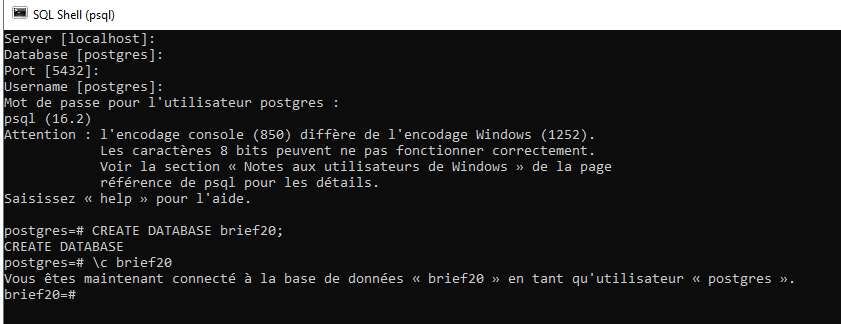
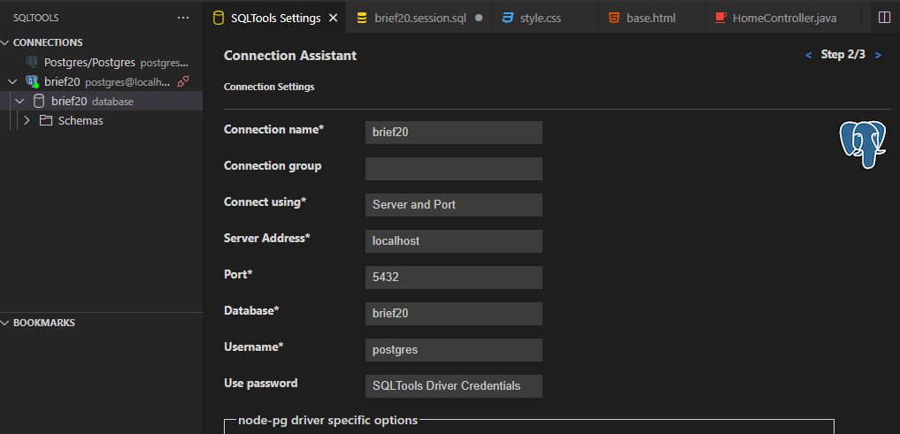
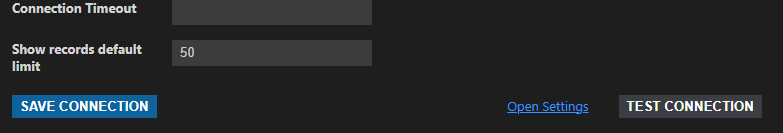
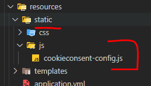
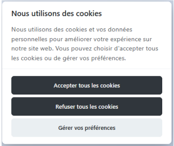
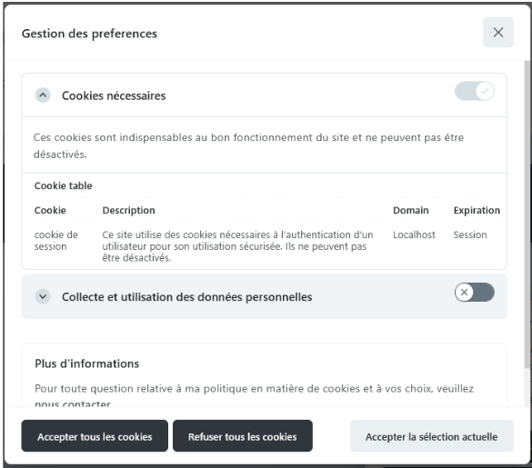
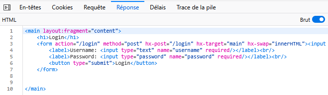

# Brief 20 : Conformité RGPD et intégration de HTMX.

## Initialisation du projet.

### 1. Créer et associer une base de données.



### 2. Connection à la base sur VS code : 





## Lancement du projet Maven.

``` mvn spring-boot:run```


## Conformité RGPD

### 1. Ajout d'un fichier cookiesconsent-config.js dans le dossier : __resources/static/js__



### 2. Paramètrage de la fenêtre de gestion de cookies : ```cookieconsent-config```

### 3. Balise ````<link>```` pour le CSS :
Balise à placer dans la section <head> de votre fichier HTML pour inclure le fichier CSS
````
<link rel="stylesheet" href="https://cdn.jsdelivr.net/gh/orestbida/cookieconsent@3.1.0/dist/cookieconsent.css" />
````

### 4. Balise ````<script>```` pour le JavaScript :
Balise à placer juste avant la fermeture de la balise <body> pour inclure le fichier JavaScript.
````
<script type="module" th:src="@{/js/cookieconsent-config.js}"></script>
````

### 4. Rendu de l'affichage de la fenêtre.






## Intégration d’HTMX

### 1. Insertion de la bibliothèque HTMX dans <head>.

```
<script src="https://unpkg.com/htmx.org@2.0.4"
        integrity="sha384-HGfztofotfshcF7+8n44JQL2oJmowVChPTg48S+jvZoztPfvwD79OC/LTtG6dMp+"
        crossorigin="anonymous"></script>
```

### 2. Utilisation.
#### a. Creation des layouts.
Ils permettent de réutiliser des sections communes de l'interface utilisateur, comme les en-têtes, les pieds de page sur plusieurs pages de l'application :
- layout.html
- layoutEnd.html

#### b. Adaptation aux pages.
Adapatation des pages :
- dashboard.html
- login.html
- register.html

exemple pour _register.html_: 
````
<head-fragment th:replace="~{layouts/layoutStart :: layout-start}"></head-fragment>
<main th:replace="~{fragments/register :: main}"></main>
<footer-fragment th:replace="~{layouts/layoutEnd :: layout-end}"></footer-fragment>
````

#### c. Gestion dans les controllers pour l'affichage des pages complètes, ou uniquement le fragment.
Modification des controllers : 
- AuthController
- HomeController

Exepmple de _HommeController_ :
````
@Controller
public class HomeController {
    @GetMapping
    public String dashboard(Model model,
            @RequestHeader(name = "HX-Request", defaultValue = "false", required = false) boolean isHTMX) {
        if (isHTMX) { //  affichage de la page complète ou du fragement si l'en-tête HX-Request est présent et vaut true.
            return "fragments/dashboard";
        } else {
            return "pages/dashboard";
        }
    }
}
````
Explications :
Avec l'ajout de ````@RequestHeader(name = "HX-Request", defaultValue = "false", required = false) boolean isHTMX)````

Si l'en-tête HX-Request est présent et vaut true, la méthode retourne le fragment,
sinon, elle retourne la page complète.

Vérification avec l'inspecteur dans le navigateur :
Après l'inscription d'un nouvel utlisateur via la route : http://localhost:8080/register
afficahge de la page login avec uniquement le main : 


